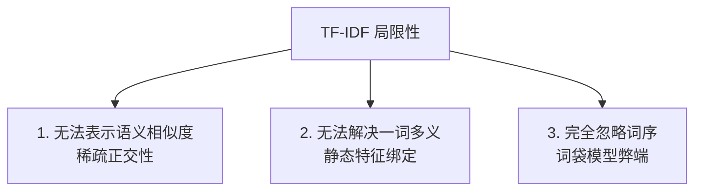

# 🏛️ 项目 1 深度分析：从零实现垃圾邮件分类器

在这个项目中，我们用**纯 Python**实现了一个高效的垃圾邮件分类系统。虽然代码没有依赖任何复杂的深度学习框架，但它完美体现了 AI 发展初期，科学家们在**文本数字化**和**概率分类**领域的智慧结晶。

通过此文档，我们将深度剖析底层的算法齿轮，以及为什么它会面临不可逾越的瓶颈，从而自然地推导出我们为什么要走向下一个技术时代。

---

## 📐 底层数学与算法推导

### 1. TF-IDF 的物理直觉：提取词汇的“区分度”
文本数字化的最简单想法是“词频统计”（Term Frequency），但如果只统计频率，“the”, "of", "and" 等无意义的虚词会占据主导地位。

**TF-IDF** 巧妙地通过两部分的乘积解决了这个问题：

$$TF\text{-}IDF(t, d) = TF(t, d) \times IDF(t)$$

*   **TF (Term Frequency, 词频)**：
    $$TF(t, d) = \frac{\text{单词 } t \text{ 在文档 } d \text{ 中出现的次数}}{\text{文档 } d \text{ 中的总单词数}}$$
    *   *物理意义*：评估单词在**当前这篇文档**中的局部重要性。一个词在邮件里出现得越多，它就越能代表这封邮件的主题。
*   **IDF (Inverse Document Frequency, 逆文档频率)**：
    $$IDF(t) = \ln\left(\frac{1 + N}{1 + DF(t)}\right) + 1$$
    *   *物理意义*：评估单词在**整个语料库**中的全局区分度。如果一个词在所有邮件里都出现（比如 "meeting"、"hi"），说明它是个大通货，区分度极低，IDF 分数会趋近于 1；而如果一个词只在极少数邮件中出现（比如 "lottery"、"invoice"），说明它是一个高度特异的词，IDF 分数会非常高。

---

### 2. 朴素贝叶斯：概率分类的最简美学
在拿到每封邮件的 TF-IDF 特征向量 $x = [x_1, x_2, \dots, x_V]$ 后，我们要计算它属于垃圾邮件（Spam, $c=1$）和正常邮件（Ham, $c=0$）的概率。

根据**贝叶斯公式**：

$$P(c | x) = \frac{P(c) P(x | c)}{P(x)}$$

为了求出概率最高的类别，由于分母 $P(x)$（收到这封邮件的概率）是常数且对两个类别相同，我们可以省去分母，只需最大化分子：

$$P(c | x) \propto P(c) P(x | c)$$

#### 为什么叫“朴素”（Naive）？
如果特征 $x_1, x_2, \dots, x_V$ 相互关联，计算联合概率 $P(x_1, x_2, \dots, x_V | c)$ 将极其困难（参数空间呈指数级爆炸）。
朴素贝叶斯做出了一个**极其大胆（甚至有点“天真”）的假设**：
> **特征条件独立假设**：在给定类别 $c$ 的情况下，句子中各个单词的出现是彼此互不相关的。

在这个假设下，联合概率可以简单地拆解为每个词的条件概率乘积：

$$P(c | x) \propto P(c) \prod_{j=1}^{V} P(x_j | c)$$

这极大地简化了计算，模型只需要统计每个词在各个分类下的加权词频即可。

---

## 🛠️ 核心工程挑战与解决方案

我们在 `scratch_classifier.py` 中优雅地解决了两个经典的机器学习工程问题：

### 1. 数值下溢（Numerical Underflow）与对数空间（Log-space）
*   **问题**：由于词汇表很大，每个单词的条件概率 $P(x_j | c)$ 通常是一个极小的浮点数（例如 $0.0001$）。如果把几百个这样的小数相乘，计算机会因为浮点数精度限制，直接把结果截断为 $0$。
*   **解决**：我们取**自然对数**。因为对数函数具有将乘法变加法的性质：$\ln(A \times B) = \ln A + \ln B$。
    因此，我们的计算公式从乘法变成了累加：
    $$\ln P(c | x) \propto \ln P(c) + \sum_{j=1}^{V} x_j \ln P(w_j | c)$$
    这使得计算不仅非常稳定，而且在计算机里加法运算远比乘法运算快。

### 2. 未见词与零概率灾难
*   **问题**：如果在测试集中出现了一个训练集里从未在“垃圾邮件”中见过的词，它的 $P(w_{\text{new}} | \text{Spam})$ 会是 $0$。如果没有处理，这一个 $0$ 会导致整个句子的累乘结果直接变成 $0$。
*   **解决**：**拉普拉斯平滑（Laplace Smoothing）**。
    在计算条件概率时，我们在分子加上 $\alpha$（通常设为 1.0），在分母加上 $\alpha \times \text{词表大小}$。这样即使词频为 0，该词依然能分得一个极其微小但非零的概率，保证了系统的鲁棒性。

---

## ❌ 致命瓶颈：为什么我们必须走向下一个时代？

虽然朴素贝叶斯在垃圾邮件分类中表现出色，但随着互联网的发展，这种基于 TF-IDF 统计的技术面临了**不可逾越的物理限制**，导致它无法通往更高维度的智能：

1.  **无法表示语义相似度（稀疏正交性）**：
    在 TF-IDF 的高维向量中，每一个单词都是空间中的一个独立坐标轴。
    *   例如：`"happy"` 和 `"joyful"` 是近义词。但在词袋模型中，它们被视为两个完全垂直（正交）的维度。
    *   如果训练集里全都是 `"happy"` 标记为好评，而测试集里出现 `"joyful"`，分类器根本无法将 `"joyful"` 的语义迁移到 `"happy"` 上，两者的余弦相似度为 $0$。
2.  **无法解决一词多义（Polysemy）**：
    TF-IDF 给每个单词计算出的 IDF 是全局静态的。
    *   例如 `"Apple"`（苹果公司）和 `"Apple"`（水果）在词表里共用同一个索引和权重，模型无法根据它们周围的词进行区分。
3.  **完全忽略词序与语法**：
    “不 喜欢 欺骗，我 喜欢 诚实” 和 “喜欢 欺骗，我 不 喜欢 诚实” 的 TF-IDF 特征向量几乎完全一致，因为它把整句话打碎成了一个无序的“袋子”。

---

## 🚀 下一步演进：解锁项目 2

为了彻底解决 **“词与词之间的语义相似度”** 这一世纪难题，AI 科学家们推倒了词袋模型的高维稀疏墙壁，创造了 **Word2Vec（词向量嵌入）** 技术。

他们不再为每个单词分配一个独立的高维正交轴，而是将所有词映射到一个**低维稠密的连续几何空间（比如 300 维）**中，在这个空间里，语义相似的词会自动“靠拢”，从而让计算机真正具备了语义联想能力。

你准备好进入 **👉 [项目 2：语义相似度与向量空间](./P2_semantic_search/README.md)** 探索这个奇妙的几何世界了吗？
